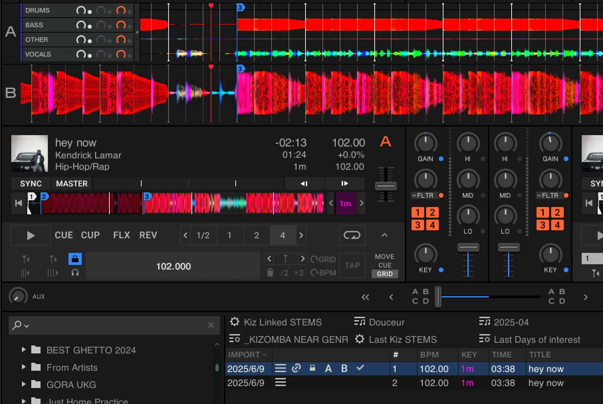

Did a small experiment in Traktor Pro 4.1.1

- I created a .stem.m4a file that has "silent" drums, even though the original has drums.
- Loaded into deck as standalone .stem.m4a file and tried messing with individual stem controls (volume, filter) - the track DOESN'T play DRUMS. This confirms that "sum of stems != original" when played as standalone .stem.m4a
- Generated native TP4 STEMS, and then replaced generated .stem.mp4 file with my file (including necessary file metadata to play in TP4). Result is the same: the track DOESN'T play DRUMS.

TLDR: "sum of stems != original" in Traktor Pro 4.1.1 (at least), so if you truly want to play "complete" song - you need to generate stems using NUO-STEMS 🤷‍♂️

p.s. I didn't install 4.2.0 because it has some bugs related to files relocation that cause crashing, afaik
