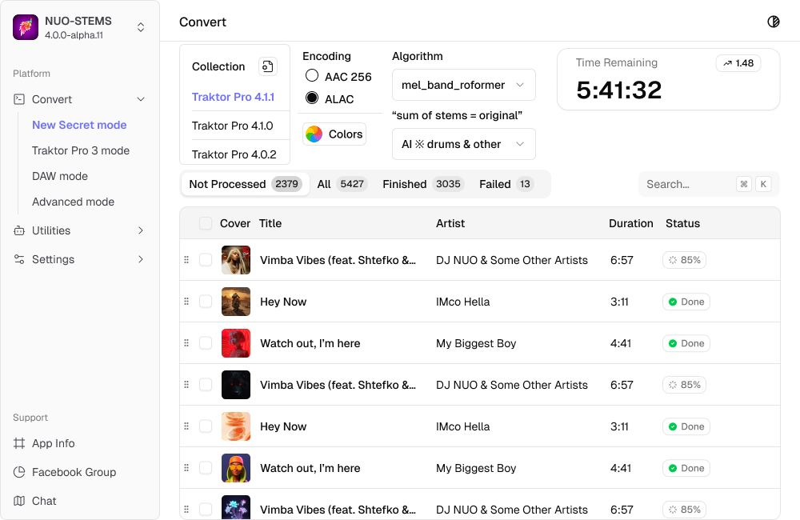

If you feel like you can help with NUO-STEMS re-design & can work in Figma - let me know 🙂
I have certain updates coming up, and want the app to feel more modern & fresh
UX is a big part as well & that's my main struggle.

**TLDR: UX & UI designer is welcome)**

Facebook post: [link](https://www.facebook.com/groups/nuostems/posts/2437275466645370/)
