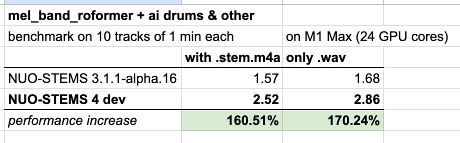

- Expecting to squeeze even more performance than here 🤫 (for existing mel_band_roformer algorithm)
- No release date yet; not publicly available, even for testers
- New algorithm upcoming (not ready to present yet)
- Upgrade price from v3 to v4 will probably be 9.99 🙂
- ...))))
