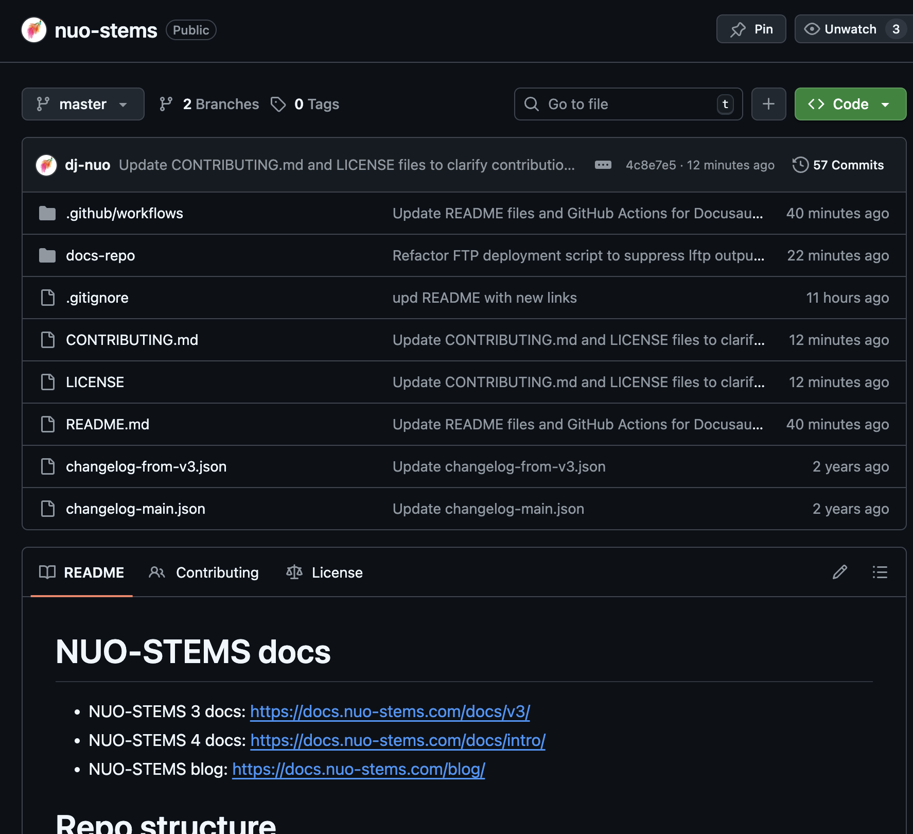

It is still work-in-progress, but it's already source-available on GitHub: https://github.com/dj-nuo/nuo-stems
 If you want to contribute to Docs - feel free.
 In the nearest future I'm considering adding NUO-STEMS frontend code there as well for NUO-STEMS 4 (which is not released yet, and release date is unknown).

**Why?**
 It allows those of you who are interested, to bring new UX/features to frontend or Docs of NUO-STEMS. This includes but not limited to translations. The License is completely copyright, so the goal here is just to give you tools to affect the project more as we go forward 🙂
