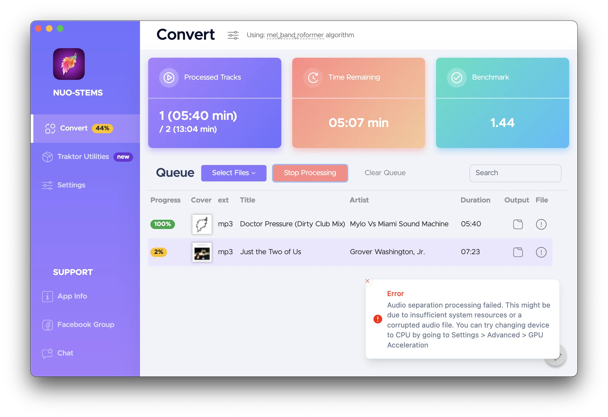

NUO-STEMS 3.1.1-alpha.17 updates. Let me know if it works for you.

<!-- truncate -->

Changes:

- Fixed a bug where some .mp3 tracks couldn't be added to the queue
- Fixed a bug where loading Traktor collection caused NUO-STEMS to crash
- More robust implementation to check if Traktor Pro is running
- Improved error handling. NUO-STEMS now shows a more informative error message in the bottom right corner of the app.
