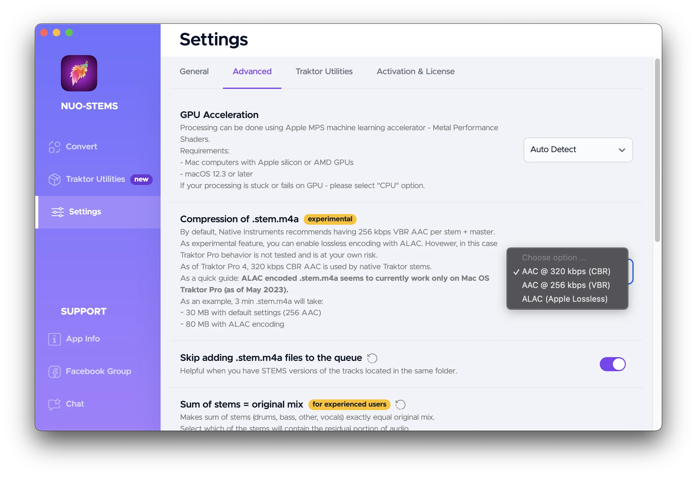
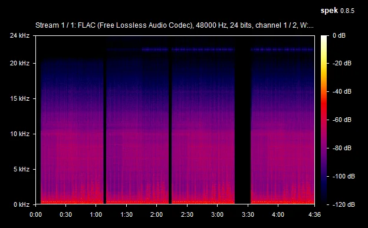

# Changes

## Features

- New compression format: AAC 320 kbps (CBR).
  - Traktor Pro 4 introduced this format for native stems, and it's now supported by NUO-STEMS.
  - Previous AAC 256 (VBR) is still supported and remains the dafault option in NUO-STEMS. Because it provides 25% smaller file size.

<!-- ### Example

- Left section of the spectrogram is 320 kbps (CBR)
- Right section of the spectrogram is 256 kbps (VBR)
  - Notice noise at 21 kHz. -->
