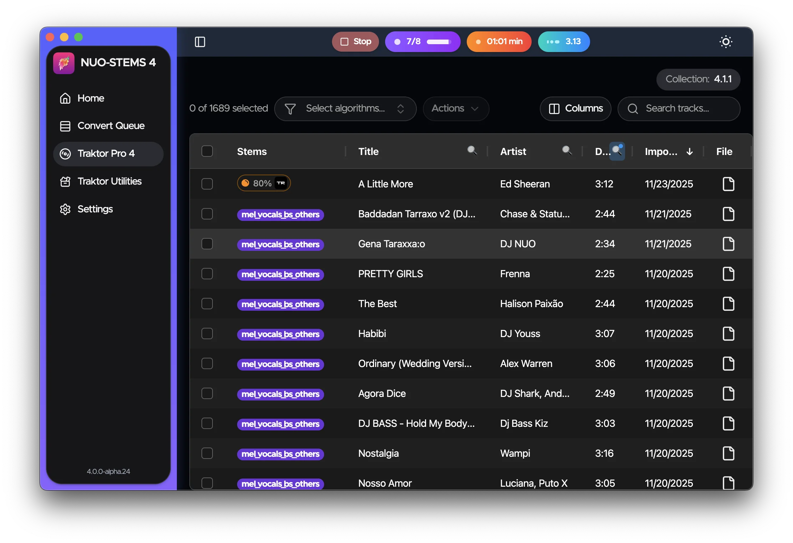

Release the kraken! NUO-STEMS 4-alpha is now fully integrated with Traktor Pro 4.

Yes, linked native STEMS! 🔥

<!-- truncate -->

👉 Please write me in private messages or to djnuo95@gmail.com, and I will send you the installer 🚀

For now it's Apple Silicon only. Windows support is coming soon. MacOS Intel support is coming soon.

See NUO-STEMS 4:

- [Docs](/docs/intro) for more information.
- [FAQ](/docs/faq) for more information.
- [Roadmap](/docs/roadmap) for more information.
- [Discord](https://discord.gg/dfpk9FbvJE) for more information.
- [Facebook group](https://www.facebook.com/groups/nuostems/) for more information.

Months of hard work, millions of burned LLM tokens, sleepless nights and battle-testing in actual gigs.
Now you don’t need to have 2 separate entries in your collection for original and .stem.m4a.
STEMS are stored & displayed in Traktor Pro 4 as “native, linked STEMS”.

NUO-STEMS 4 works only with Traktor Pro 4. This is a deliberate decision - I want you to support Traktor team by upgrading to Traktor Pro 4. I strongly believe that 50$ (as of Black Friday deals) is a great value for what you’re getting - it’s an investment into future of Traktor.

You can still generate .stem.m4a files for Traktor Pro 3, but there are no “Traktor Utilities” to transfer metadata between originals and .stem.m4a. This also means that you can omit having originals altogether, and just use .stem.m4a in TP4 to save disk space.

Grid offset also seems improved even more (100% accuracy on my collection).

Also, as promised, all the users who purchased NUO-STEMS 3 after the date of 1 November 2025 will automatically be upgraded to NUO-STEMS 4.

My next step is to make everything work on 🔥Windows🔥, so stay tuned for that announcement.

As a reminder, we now have Discord server: https://discord.gg/dfpk9FbvJE

# Updates from alpha.27 to alpha.29

- 4.0.0-alpha.29
  - track analytics reason for STEMS_JOB_POLLING_FAILED to understand the root cause
  - extended tooltip for "traktor" tracks in queue to mention that .stem.m4a will not be created in this mode
  - When removing Traktor STEMS, additionally remove track from Queue if it's present in the queue
  - check for QUEUE_ITEM_IN_QUEUE_ALREADY_CONVERTED (File already exists in queue with 100% progress)
  - fix: save wav and instrumental+acapella even if track added as type "traktor"
  - added check: TRAKTOR_STEMS_NOT_ALLOWED_IN_DEMO_MODE when adding track to the queue
  - check for TRAKTOR_ENTRY_NO_AUDIO_ID when adding tracks to queue and also when starting converting per track.
  - some polishing of checkIfTraktorRunning()
- 4.0.0-alpha.28
  - fix: analytics.trackTrackConversion() reporting errors when there are none, processing time being 0 or wrong.
  - temporarily remove links to Traktor Utilities
- 4.0.0-alpha.27 - THE KRAKEN
