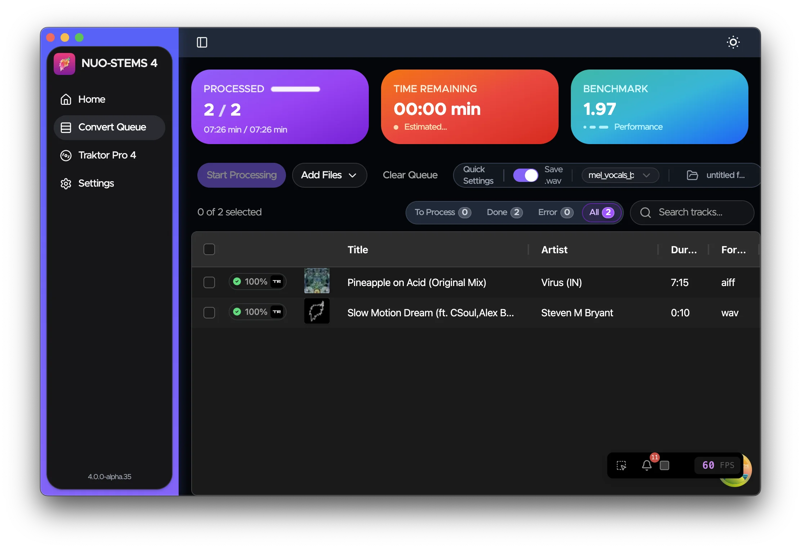
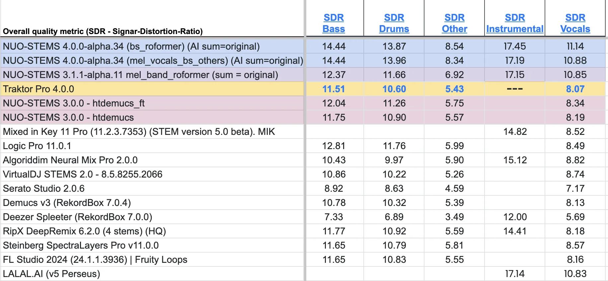
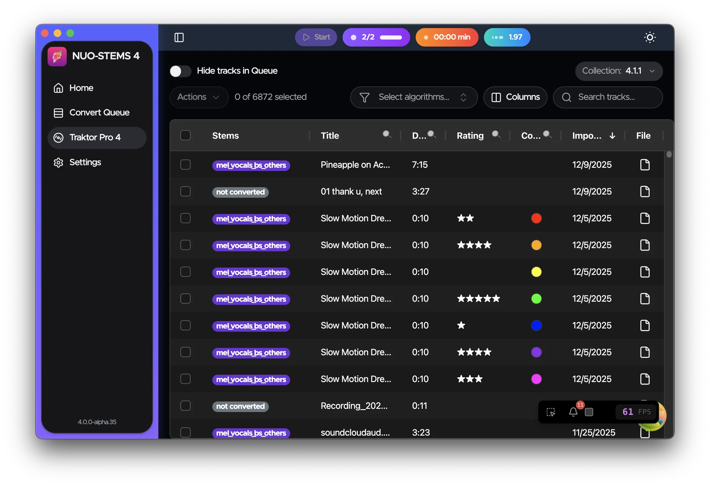

NUO-STEMS 4 alpha is now available on Windows, Apple Silicon and Intel Mac 💪

<!-- truncate -->

👉 Please write me in private messages or to djnuo95@gmail.com, and I will send you the installer 🚀

Key new features:

- Traktor Pro 4 "natively linked" stems integration
  - 
- New & improved quality of STEMS algorithms
  - 

All the discussions are actively happening in Discord: https://discord.gg/dfpk9FbvJE

You can jump in to share your proposals, feature requests etc.

See NUO-STEMS 4:

- [Docs](/docs/intro) for more information.
- [FAQ](/docs/faq) for more information.
- [Roadmap](/docs/roadmap) for more information.
- [Discord](https://discord.gg/dfpk9FbvJE) for more information.
- [Facebook group](https://www.facebook.com/groups/nuostems/) for more information.
