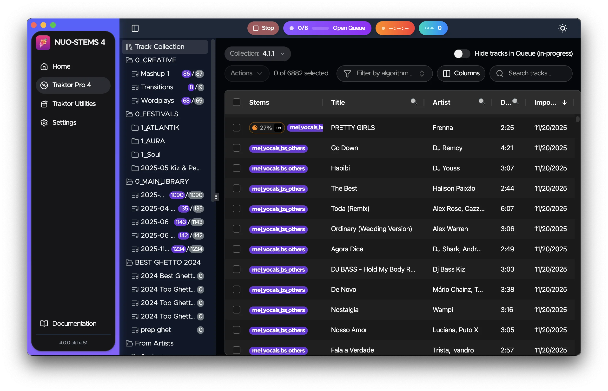

### Last chance to get maximum discount to NUO-STEMS 4 ‼️

**Starting January 1, 2026 NUO-STEMS 4 will be released as public beta**.\
This means that anybody will be able to download it without the need to write me.

What it also means is that it’s your last chance to get maximum discount while NUO-STEMS 4 is still in closed alpha (**2 days left**).

Upon beta release, users who already own NUO-STEMS 3 will get emails with upgrade coupons, but discount will be much lower.

Current upgrade price for NUO-STEMS 4 alpha is 19.99 (after coupon is applied for 40% discount from regular price of 33.99).

**Public beta discount will be 20%.**

Please write me to djnuo95@gmail.com or in private messages to get the installer of NUO-STEMS 4 alpha.

See NUO-STEMS 4:

- [Docs](/docs/intro) for what's new
- [FAQ](/docs/faq)
- [Roadmap](/docs/roadmap)
- [Changelog](/docs/changelog)
- [Discord](https://discord.gg/dfpk9FbvJE)
- [Facebook group](https://www.facebook.com/groups/nuostems/)
