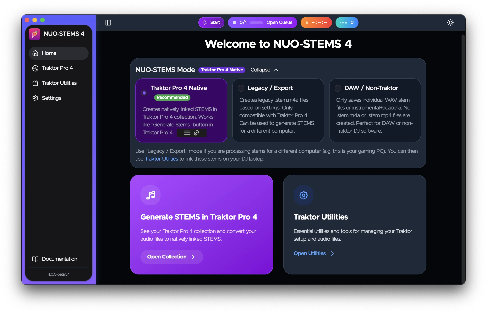
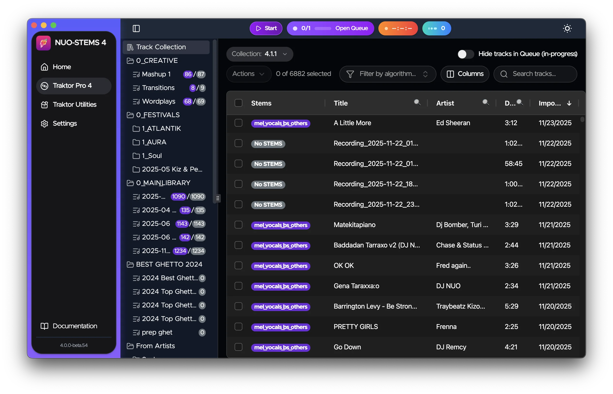

### NUO-STEMS 4 is now in public beta

With **natively linked Traktor Pro 4 STEMS**🚀 and **improved quality**😍 of STEMS algorithms.

NUO-STEMS 4 is now in public beta. This means that everyone is able to [download it](/docs/download).

See [NUO-STEMS 4 Docs](/docs/intro) for what's new 🎉

Existing users who already own NUO-STEMS 3 will get emails with upgrade coupons soon 😉. If you can't wait to get a discount, just [write me](/docs/contact-support) 🥳.

p.s. updated website will come soon, as well as video tutorials.