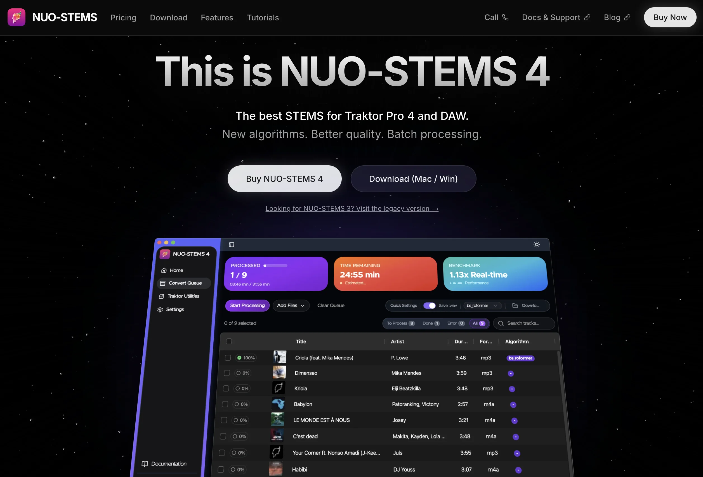
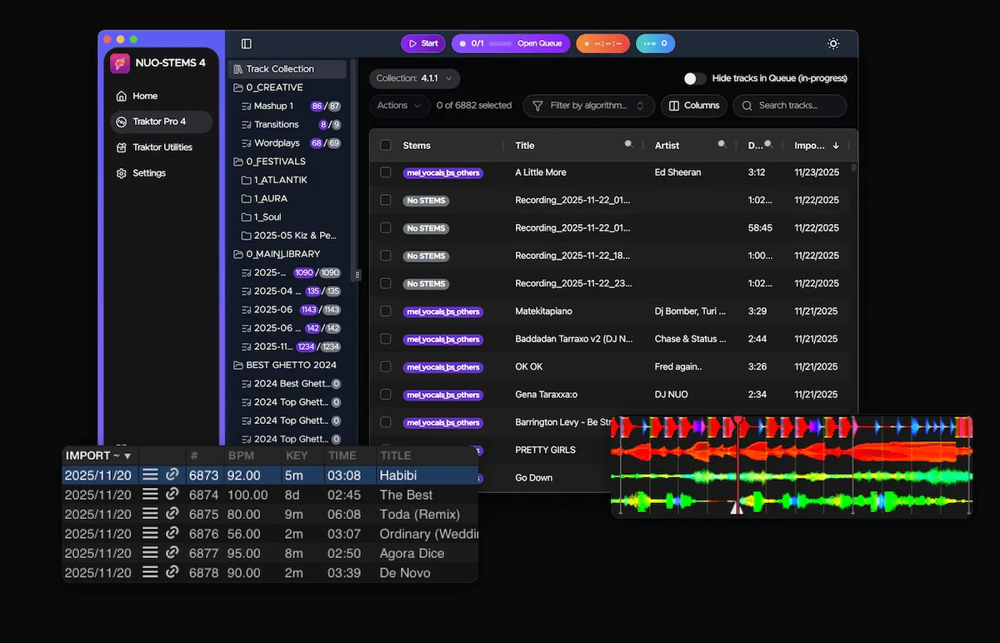

### NUO-STEMS 4 now has a new website 🎉 (and licensing system)
Website: https://nuo-stems.com/

With **natively linked Traktor Pro 4 STEMS**🚀 and **improved quality**😍 of STEMS algorithms.

Took surprisingly huge amount of effort and dedication 😅.

Also, new users will experience improved licensing system. You will get license key to your email upon purchase that is then entered into NS4. No more need to install NS4 and get Hardware UUID to complete purchase 💪

Existing users who already own NUO-STEMS 3 will get emails with upgrade coupons soon in the next few days (emails are sent out gradually, so that I'm not put in spam or smth). If you can't wait to get a discount, just [write me](/docs/contact-support) 🥳.

