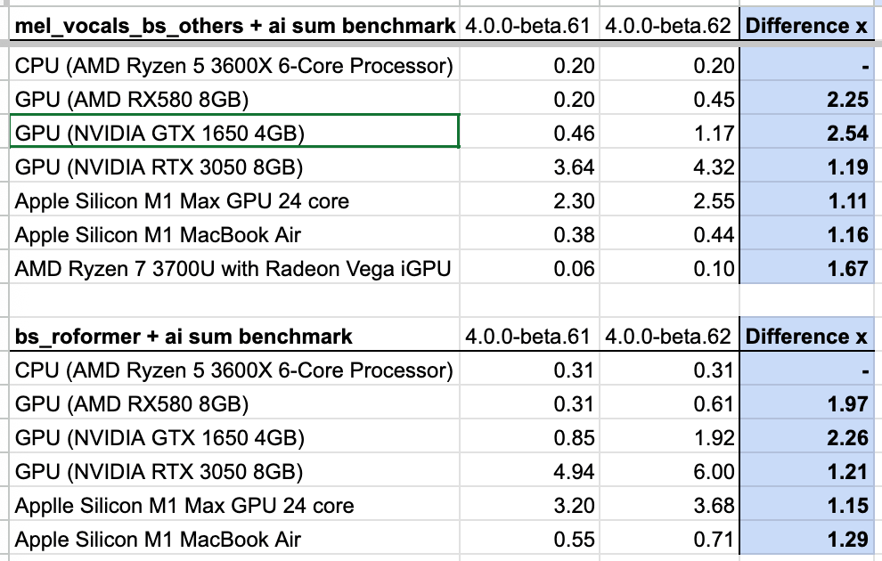

### AMD & Intel GPU support and performance improvements

With the release of **NUO-STEMS 4.0.0-beta.62**, performance has taken a major step forward across multiple platforms:
- **DirectX 12 GPU acceleration** is now supported, including **AMD** and **Intel GPUs** on Windows. Requires FL 12.0 or higher
- **NVIDIA GPUs** and **Apple Silicon** also benefit from further optimization, with typical speed gains of around **10–20%.**
- On some **older NVIDIA cards**, such as the **GTX 1650**, the improvement is even more dramatic, reaching roughly **2x to 2.5x faster** performance.

**Benchmark Results:**

*Benchmark is how much faster than real-time track is processed. Higher is better. "Difference ×" is how much faster the new version is compared to the old version.*

p.s. to see clean benchmark results, clear the queue after updating to NUO-STEMS 4.0.0-beta.62.

Download NUO-STEMS 4: https://nuo-stems.com/ or update in-app.