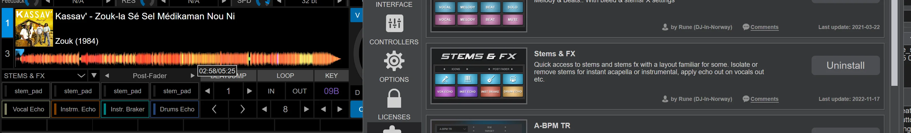

# Roadmap

## Priorities:
- [x] Fix all the bugs that users have reported.
- [x] Windows support.
- [x] MacOS Intel support.
- [ ] Everything else.

## Feature list:
- [ ] It would definitely be very cool if NS4 had an option to add automated metadata: for example, a fixed #tag that could be added to the comments or comments 2. Ideally, it would also indicate whether it was generated with #BS or #mel_band. For example, #NS4 mel / #NS4 bs

>I will not include algorithm into it.
>But just give user an option to set whatever text into few predefined tags (e.g. comment1, comment2, genre, lyrics)

Then I can create a smart list in Traktor again and/or search for it in the browser.

- [ ] Figure out the best way to migrate from NUO-STEMS 3 .stem.m4a (and no originals) to linked native stems.
    - Use case: user only has NUO-STEMS 3 .stem.m4a files in their collection, and no originals.
        - [ ] Proposal (have to experiment if AUDIO_ID stays the same):
            - [ ] Extract original mix from .stem.m4a
            - [ ] Replace file path, STEMS property in ENTRY in collection with new “original”.
- [ ] Change STEMS colors
- [ ] So what does this mean for our old stems? Does this automatically replace them or do we have to reanalyse the library and manually discard the old ones?
- [ ] Auto-start the queue when the app is launched if there are non-processed tracks in the queue.
    - any thoughts on an auto-convert mode? ie. which automatically queues up any tracks in the Traktor collection that are not yet converted as soon as Traktor is closed.

        this basically needs two things:

        1. auto start when the queue is not empty and Traktor is not running
        2. automatically adding tracks not yet converted when Traktor is closed

        Just having 1. would be nice, since I sometimes open Traktor to resolve some issue (f.e. analyze a track) but then forget to restart processing once I close Traktor.
- [x] How to use another computer to convert stems?
    

    
Click to expand technical details

    - [ ] how to know AUDIO_ID of the original track on the computer which doesn't have Traktor installed (e.g. your gaming NVIDIA PC)?
        - [ ] Your suggestion is actually quite clever... Hmmm... I can definitely write my own "hash" or for simplicity - "original filename" into .stem.m4a or .stem.mp4. 
        - [ ] Let me think about it for a day or two to understand the most robust way 🙂
        - [ ]   (e.g. I don't want to calculate hash for all entries on the main DJ computer to match with stems as it will be resource intensive and long process. But maybe it's the only reliable option and resource usage is not that high. Will have to experiment.)

        ---
        From user in Discord:
        Hey Nuo, I may have just found out how the AUDIO_ID's are generated. Check this link (scroll to the bottom for the relevant C++ function) https://www.mail-archive.com/mixxx-devel@lists.sourceforge.net/msg05061.html

        I just re-wrote it in Python and can confirm it does actually generate a valid thumbnail of the waveform! I don't wanna get ahead of myself, but I'm assuming this means if we write a new function to basically do this process backwards, we should be able to generate a perfectly valid AUDIO_ID from nothing more than the original audio track 😄
        
        ---
        My response:
        This is truly interesting find.
        BUT, you need to understand that Traktor has it's own audio decoders & decoders are pain in the ass (refer to 26ms issue here - https://pestrela.github.io/dj_kb/dj_collection_converters/ )

        With NS4 I tried to get decoders behave the same as Traktor. In works on Apple Silicon at least, while Intel MacOS & Windows are subject to confirm this finding. 
        AND, testing was limited to tracks that I have. It is subject to users of NS4 now to test whether there is truly no offset in beatgrid & hotcues between Original & Linked STEMS.

        Only once this is confirmed - it's a valid option to investigate generating AUDIO_ID from the audio itself, without relying on collection.nml.

        ----
        Some more exploration from me [Discord message link](https://discord.com/channels/1436013832391753771/1436014193571790960/1447725613472546990):
        
        Okay, some news on AUDIO_ID and potential ability to convert stems on gaming computer and then transfer to MacBook for DJing.

        IF both of your computers are on the same platform (e.g. Win + Win or Mac + Mac) - things might work. 
        IF NOT - Traktor decodes .m4a (aac/alac) files differently on MacOS vs Windows. 

        I've just tested with the same track on both systems & got different AUDIO_ID's for the same .m4a tracks.

        I haven't tested other file formats yet, but this is already a huge issue.

        This means that when you transfer .stem.mp4 files from Win,  and link to originals on Mac - there will be offset between them. According to my tests, this offset is different from track to track, ranging from 0ms to 93 ms...

        This might be okay for other formats.
        I'd like to hear your thoughts, guys

        Edit: FLAC, MP3, AIFF are fine (same on Mac & Win)

        Also, added some comments here: https://community.native-instruments.com/discussion/49074/bug-traktor-does-not-play-first-50ms-of-alac-files#latest
    

- [ ] News popup on app startup. Linked to Blog.
- [ ] Add Traktor playlists support. (see collection tree on the left side of the app)

## Hypothetical feature list:
- [ ] Offline licensing. Ability to use NUO-STEMS 4 without an internet connection.
- [x] Traktor Utilities: extract individual stems from .stem.mp4 or .stem.m4a file
- [x] It would be good if "Show STEMS file" were available from "Traktor Pro 4" tab (for converted files)
- [ ] Repair broken links for TP4 stems.
    - [ ] Identify .stem.mp4 tracks in Traktor Stems folder that don’t have correct flag in collection.nml
    - [ ] Another interesting feature would be that Nuo-Stems detects the stems in the Traktor's preferences folder that are not associated with an original file, so you could clean up and free up disk space (i.e. if you move or delete an original file, the stem will remain in the stems folder, it won't be automatically deleted).
- [ ] Support AMD GPUs acceleration.
    As of right now, AMD Rocm is not supported with PyTorch on Windows (only Linux).
    There is some experimental support, but it requires [special system drivers](https://www.amd.com/en/resources/support-articles/release-notes/RN-AMDGPU-WINDOWS-PYTORCH-PREVIEW.html).
    Not super UX-friendly, therefore not a good choice for NUO-STEMS. List of GPUs is also limited. And only Win 11.

    Vulkan is not supported in PyTorch as well on Windows. Only on [Android via ExecuTorch](https://docs.pytorch.org/executorch/stable/backends/vulkan/vulkan-overview.html).

    There seems to be a way to make ONNX work on AMD GPU on Windows, but not sure how stable it is.

    Currently, NUO-STEMS uses frozen PyTorch for inference, but I had success previously testing ONNX. On MacOS it was slower, so I abandoned this idea. 
    Anyways, my current priority is to make NVIDIA GPUs run properly on Windows using PyTorch. And when some future comes - I'll take a look at AMD GPUs and ONNX.

- [ ] VirtualDJ integration exploration. Some users report that .stem.m4a files can be played in VirtualDJ.
    :::info
    **User A reported**: 

    Ok. Just tried on Windows again, VDJ v2025 b8909 . It does indeed work (now) on Windows 💯

    All the info I could retrieve from the Song that it worked with:
    Format Mpeg-4 Audio (AAC LC) .stem.m4a 

    Steps I took before I loaded the song in VirtualDJ:
    - Created a Folder in Windows Explorer named 'VirtualDJ Stems'.
    - Copied some tracks into that folder to test.
    - VDJ Settings - Search keyword 'stem'
    - Performance - stemsRealtimeSeparation: Fully Disabled
    - Performance -stemsSavedStems: Manual
    - Performance - stemsFix: Don't use GPU
    - Performance - stemsSavedFolder -> Linked to folder I created
    - Loaded .stems.m4a song directly from the 'VirtualDJ Stems'-folder I created

    I tried EXACTLY the same on macOS (Ventura 13.6.9 on MacBook Pro 13 M1 16GB) as far as I can tell: Same Settings, Same .stems.m4a file, copied to 'VirtualDJ Stems'-folder I created on macOS. VirtualDJ version v2025-m b8909 . On macOS unfortunately it did NOT work for me ... 🙁
    Will contact Virtual DJ Support.

    ---

    To have 4 stems instead of 5 stems in VirtualDJ, you need to:
    - Go get a 4 stem pad from the extensions rather than use the default 5

    
    the combined drums stem is called rhythm in VDJ if you're doing any commands IIRC 
    also, if you ever want to get just the bass drum or just the hi hats (ish) just apply the filter to the drums

    :::

On the .stem.m4a song I loaded in VirtualDJ on Windows the 'Kick' stem is empty, the 'Hi Hat' stem is the Nuo Stems 'Drums' stem. All other stems are as you'd expect.
- [ ] Denon Engine integration exploration.
- [x] Add to queue position (top/bottom) setting. Would you be able to bring back the feature to add to top by default? It's a bit annoying that it adds to bottom and I have to drag to the top