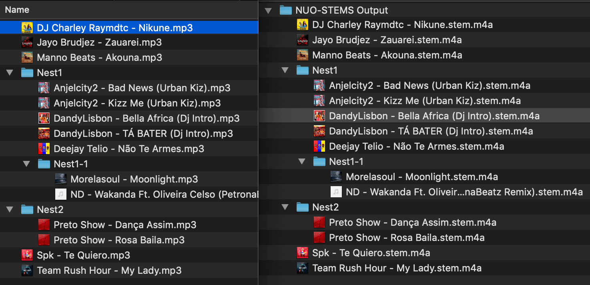

# Getting Started

Let's discover **NUO-STEMS v3 + Traktor Pro** in less than 5 minutes.

:::info
If you want to use .wav stems in your DAW (e.g. Ableton, Logic, Pro Tools, etc.), please follow this guide: [Using with DAW](./using-with-daw).
:::

## Initial launch

### Algorithm selection

Upon launch, you will be presented with a screen to select algorithm:

- **mel_band_roformer**. Provides the highest quality. Requires the most system resources.
- **htdemucs_ft**. Algorithm from NUO-STEMS v2. Requires less system resources.
- **htdemucs**. Algorithm from NUO-STEMS v2. Similar to quality of Traktor Pro 4. Requires the least system resources.

You can change your selection later in the [Settings](./settings/general-settings).

### Output folder selection

- Custom Output Folder - folder to save all the output files (.stem.m4a & .wav stems if set in settings).
- "Same as Original" output location - save .stem.m4a to the same location as original track. (also applies to .wav individual stems if set in settings)
- "Same as Original" when selecting "Input Folder" - files in **"Custom Output Folder"** maintain the structure of input folder. (This applies only when selecting "Folder" as input). 
  _This was the default behavior for "Select Input Folder" in NUO-STEMS v2_

## Queue

All the processing happens in the Queue.

You can add files to the Queue by:

- Dragging and dropping them into the application
- Clicking the "Select Files" button
- Selecting a folder to process all the files in the folder

### Adding files to the Queue

#### Drag and drop

You can select files by dragging and dropping them into the application or by clicking the "Select Files" button.

<video autoPlay loop muted playsInline style={{ maxWidth: "800px", width: "100%", height: "auto" }}>
  <source src="/videos/drag-and-drop.webm" type="video/webm" />
  Your browser does not support the video tag.
</video>

#### Select Files button

| Screenshot | Description |
|:--------------------------------------------------:|:-----------------------------|
|  | Select individual files to add to the queue.  *Tip: Hold Shift to select multiple files at once.* |
|  | Select a folder to add all its files to the queue.  *See [Output folder selection](#output-folder-selection) for how output location is determined.* |

### Converting
Once you have added files to the Queue, you can start converting them by clicking the **"Start Processing"** button.

:::warning Default output

By default, NUO-STEMS converts files to **.stem.m4a** format for playback in **Traktor Pro**. 

You can save individual stems (drums, bass, other, vocals) additionally as .wav by enabling the **"Save .wav"** option in the [Settings](#settings).
{/* TODO: add link to settings */}
:::

Once the conversion is complete, you can see the 100% progress in the Queue.

On the top, you will see 3 tiles with information:
- Processed Tracks - how many files have been converted.
- Time Remaining - how long it will take to convert the remaining files.
- Benchmark - how fast was the conversion. Higher is better. 

:::info What is "Benchmark"?
Benchmark is calculated as the time it took to convert the file divided by the duration of the file.

Example: If it took 30 seconds to convert a 90 second file, the benchmark is 3.00.
:::

And the files will be saved in the output folder.

## Playing STEMS in Traktor Pro

<video autoPlay loop muted playsInline style={{ maxWidth: "800px", width: "100%", height: "auto" }}>
  <source src="/videos/traktor-example-drag-and-drop-30fps.webm" type="video/webm" />
  Your browser does not support the video tag.
</video>

**.stem.m4a** files are "first class citizens" in Traktor Pro. You can play them back by dragging and dropping into Traktor Pro or importing them like any other file.