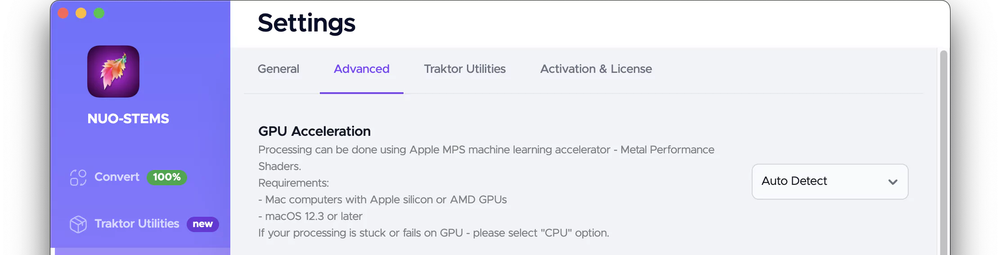
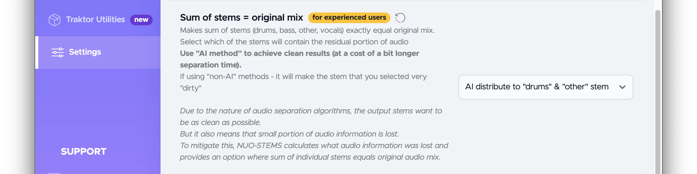

# Advanced settings
## GPU acceleration

Available options:
- Auto Detect (default)
- Disabled (using CPU only)
- GPU (Metal - MPS). **Currently, Apple Silicon & NVIDIA GPUs are supported.**

:::tip
Sometimes, Auto Detect enables GPU acceleration even if it's not available. In this case, you can try to disable GPU acceleration.

Another use case is when your computer does have a GPU, but it's specs are too low, resulting in tracks not being processed. In this case, you can try to disable GPU acceleration.
:::

## Compression of .stem.m4a

Available options:
- AAC @ 256 kbps (default)
- ALAC (Apple Lossless) @ 16 bit

By default, Native Instruments recommends having 256 kbps AAC per stem + master. As
experimental feature, you can enable lossless encoding with ALAC. Hovewer, in this case
Traktor Pro behavior is not tested and is at your own risk.

:::tip
ALAC encoded .stem.m4a seems to work only on Mac OS Traktor Pro (as of May 2023).

As an example, 3 min .stem.m4a will take (regardless of the input file encoding & bitrate):
- ~ 30 MB with default settings (256 AAC)
- ~ 80 MB with ALAC encoding
:::

## Skip adding .stem.m4a to the queue

If you enable this option, .stem.m4a will not be added to the queue.  
Helpful when you have STEMS versions of the tracks located in the same folder.

## Sum of stems = original mix
:::info
  Due to the nature of audio separation algorithms, the output STEMS want to be as
  clean as possible.  
  But it also means that small portion of audio information is lost. 
  To mitigate this, NUO-STEMS calculates what audio information was lost and provides an
  option where sum of individual STEMS equals original audio mix.
:::

Makes sum of stems (drums, bass, other, vocals) exactly equal original mix.  
Select which of the stems will contain the residual portion of audio:
- AI distribute on 'drums' and 'other' stem. 
  - Use this option to achieve clean results (at a cost of a bit longer separation time).
- Don't use
- Drums
- Bass
- Other
- Vocals

If using "non-AI" methods - it might make the stem that you selected very "dirty"

## Added silence duration

Options:
- 100ms (recommended). Adds 100ms of additional silence to the beginning of the track.
- 0ms

:::info Why 100ms?
Due to the nature of audio formats, and more importantly audio file readers, different software calculates total duration & start of the track differently.

100ms of additional silence gives headroom for [Traktor Utilities](../../traktor-utilities/general) to align the start of the track in different software and sync beatgrids & hotcues.
:::