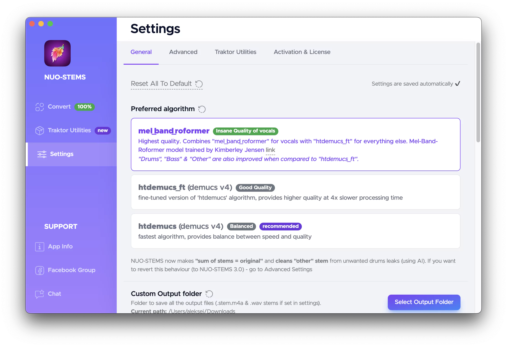
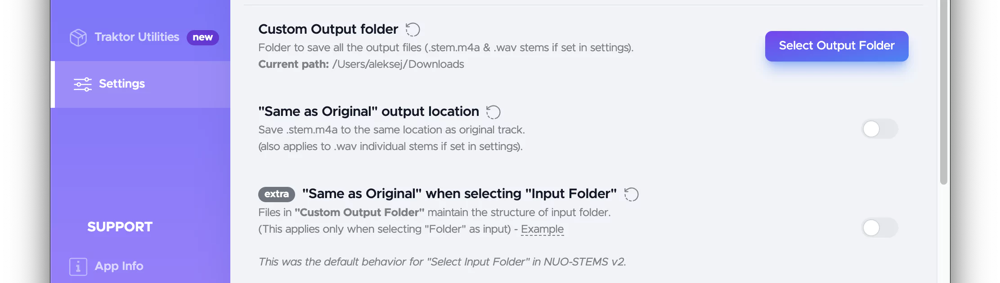
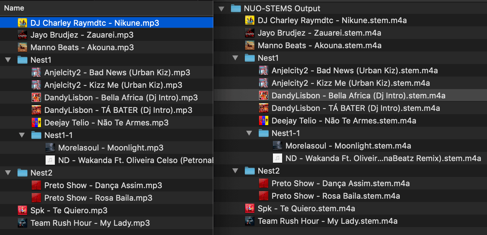
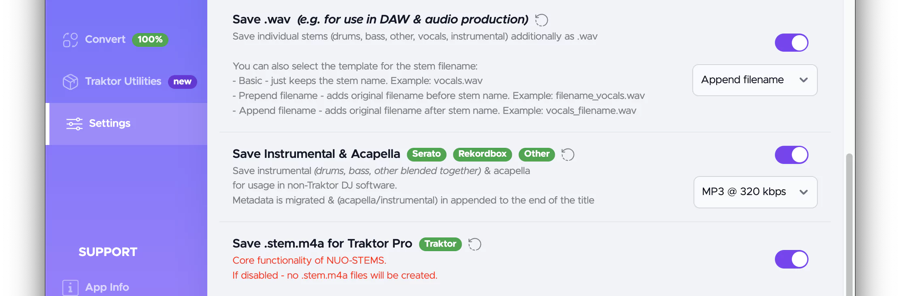
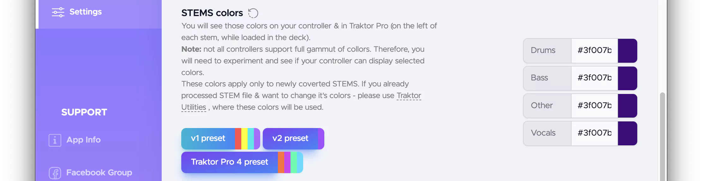

# General settings
## Preferred algorithm

Used for all unprocessed tracks in the [Queue](../../#queue).
- **mel_band_roformer**. Provides the highest quality. Requires the most system resources.
- **htdemucs_ft**. Algorithm from NUO-STEMS v2. Requires less system resources.
- **htdemucs**. Algorithm from NUO-STEMS v2. Similar to quality of Traktor Pro 4. Requires the least system resources.

## Output folder

- Custom Output Folder - folder to save all the output files (.stem.m4a & .wav stems if set in settings).
- "Same as Original" output location - save .stem.m4a to the same location as original track. (also applies to .wav individual stems if set in settings)
- "Same as Original" when selecting "Input Folder" - files in **"Custom Output Folder"** maintain the structure of input folder. (This applies only when selecting "Folder" as input). 
  _This was the default behavior for "Select Input Folder" in NUO-STEMS v2_

## Output format

### Save .wav
Explained in detail in the [Using with DAW](../../using-with-daw) section.

### Save Instrumental & Acapella
You can save Instrumental (full track without vocals) & Acapella as 
- .wav
- .mp3 320 kbps

### Save .stem.m4a
If you don't use NUO-STEMS for creating STEMS for Traktor Pro, you can disable saving .stem.m4a.
:::tip
**.stem.m4a** is Native Instrument's format for STEMS. It's [open source](https://www.stems-music.com/) and is essentially a multi-track .mp4/.m4a file (think of it as a video file with audio tracks).
:::

## STEMS colors

:::important
These colors apply only to newly coverted STEMS. If you already processed STEM file & want to change it's colors - please use [Traktor Utilities](../../traktor-utilities/general), where these colors will be used.
:::

You will see those colors on your controller & in Traktor Pro (on the left of each stem,
while loaded in the deck).

:::note
Not all controllers support full gammut of colors. Therefore, you will need to experiment
and see if your controller can display selected colors.
:::

## Position of newly added tracks in the queue

You can choose to add  new tracks to the top or bottom of the Queue.
