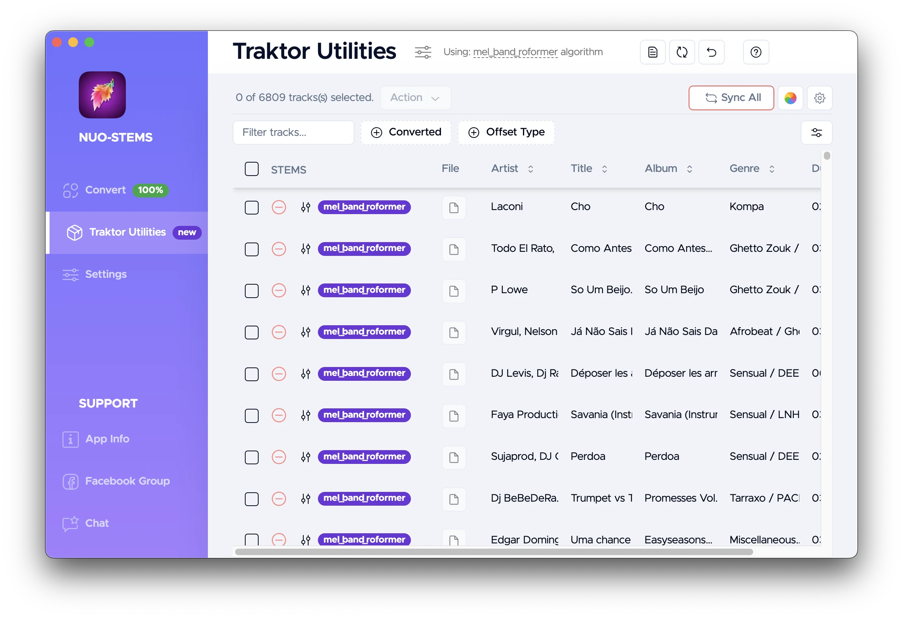
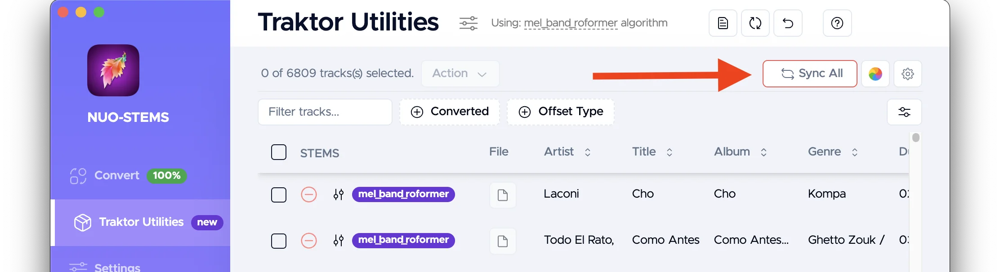
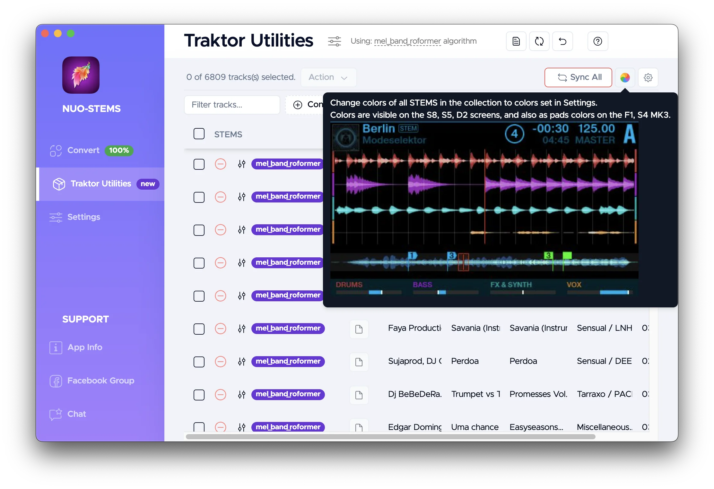
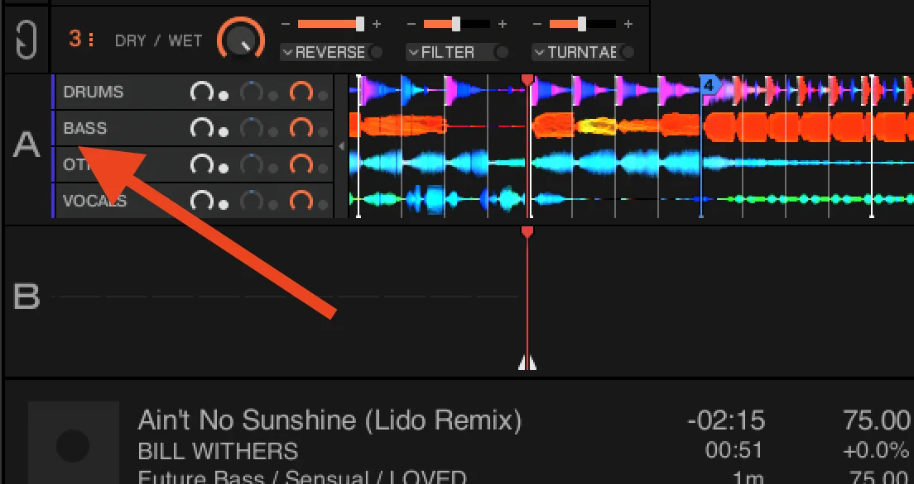

# Traktor Utilities - General
## What is it?

Imagine you have an existing collection of tracks in your Traktor Pro library.

Now, you want to convert them to STEMS using NUO-STEMS, but you don't want to lose your metadata.

Traktor Utilities is used to transfer you Hotcues, Beatgrids & other metadata between STEMS tracks and their originals.  
You can also change colors of individual STEMS parts (drums, bass, other, vocals).
:::warning
Traktor Utilities works properly only with .stem.m4a files created in **full version** (non-demo) of NUO-STEMS.
:::

*Example of Traktor Utilities screen. Shows the list of all the tracks in your Traktor Pro library.*

## How to use?
### Transfer metadata, beatgrid & hotcues
- [Convert your tracks](../../) to STEMS using NUO-STEMS.
- Close NUO-STEMS.
- Keep your originals in your Traktor Pro library.
- Add STEMS to your Traktor Pro library. (same way as you add originals to playlists, folders etc.)
- Close Traktor Pro.
- Open Traktor Utilities in NUO-STEMS.
- Click "Sync All".

Now all the metadata from the original tracks will be transferred to their STEMS versions.

See [Traktor Utilities Settings](../settings) section for more options (including transfer direction)

:::tip
Traktor Utilities identifies the latest Traktor Pro collection.nml automatically.
Meaning if you have:
- `/Users/your_user/Documents/Native Instruments/Traktor 4.1.1/collection.nml`
- `/Users/your_user/Documents/Native Instruments/Traktor 4.2.0/collection.nml`

Traktor Utilities will automatically use Traktor Pro 4.2.0 collection.nml.

You can also [manually select](../settings) another collection.nml. 
:::

:::tip
This is a one-time operation. If you later change metadata in the original tracks, you can always transfer it back to the STEMS versions using Traktor Utilities.
:::

:::warning
Traktor Utilities detects "pairs" (original & STEMS version) by their file names (priority) and music fingerprint (second priority, only if multiple file names are the same). So make sure to not change file names of your originals or STEMS after initial conversion.

Example of matched pair:
- Original track: `The Weeknd - Blinding Lights (Original Mix).mp3`
- STEMS track: `The Weeknd - Blinding Lights (Original Mix).stem.m4a`

If you change the file name of the original track to `The Weeknd - Blinding.mp3`, Traktor Utilities will not be able to find the STEMS track.
:::

### Change STEMS colors

You can change the colors of individual STEMS parts (drums, bass, other, vocals).

See [Traktor Utilities Settings](../settings) section for how to change colors.

Colors are then reflected in Traktor Pro (on the left of each stem, while loaded in the deck), as well as on the controller (e.g. S4 MK3, F1, D2 etc.)

## Recommended workflow
As an **opinionated** guide, here are two ways of how to use Traktor Utilities with NUO-STEMS v3.

### Option 1 - keep both originals & STEMS

:::tip
We recommend to keep both originals & STEMS in your Traktor Pro library.

Why? Because STEMS algorithms become better over time. And it's better to generate updated STEMS from the originals, instead of [compressed AAC 256 kbps](/docs/v3/settings/advanced-settings/#compression-of-stemm4a) (ALAC may be acceptable, but we haven't tested this approach)
:::

Workflow looks like this:
- Both originals & STEMS keep living in your Traktor Pro library.
- When you add new track to your Traktor Pro library, you add them as originals (e.g. .mp3, .wav, .m4a, etc.)
- You do all the metadata, beatgrids, hotcues **on the originals**.
- You convert your originals to STEMS using NUO-STEMS.
- You can use Traktor Utilities to transfer metadata, beatgrids, hotcues from the originals to their STEMS versions.

Any time you need to change metadata, beatgrids, hotcues:
- Edit the original track in your Traktor Pro library.
- Use Traktor Utilities to transfer metadata, beatgrids, hotcues from the originals to their STEMS versions.

Yes, this process is a bit tedious. But the benefit is that you can always go back to the originals if you need to.

:::tip
I personally use Genre to store my "tags". And then I have multiple smart playlists based on Genre tags.

Example:
- Track 1 Genre: "House / Techno / Chill"
- Track 2 Genre: "Deep House / Chill"

Possible smart playlists:
- "All Chill" (all tracks with "Chill" in the Genre): Track 1, Track 2
- "All House" (all tracks with "House" in the Genre): Track 1, Track 2
- "All Techno" (all tracks with "Techno" in the Genre): Track 1

This way I don't need to re-do my playlists. As STEMS have the same Genre tags as the originals.
  The only additional condition I need to add is "Track must be a STEMS".

:::

### Option 2 - keep only STEMS

Workflow:
- Instead of adding originals to your Traktor Pro library, first convert them to STEMS using NUO-STEMS.
- Add STEMS to your Traktor Pro library. (same way as you add originals to playlists, folders etc.)
- Delete originals from the computer.

It's best to use [ALAC compression](/docs/v3/settings/advanced-settings/#compression-of-stemm4a) in this case.

:::tip
This workflow results in less storage usage on your computer. Because you don't need to store originals.

However, we're not fans of such approach, and recommend using [Option 1](#option-1---keep-both-originals--stems)
:::