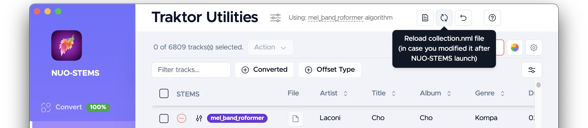

# Traktor Utilities - Settings

## Settings page

### Metadata transfer direction

Available options:
- "Original to STEMS" (default) - transfer metadata, beatgrids, hotcues from the original tracks to their STEMS versions.
- "STEMS to Original" - transfer metadata, beatgrids, hotcues from the STEMS tracks to their original versions. Useful, when you want to edit metadata only on the STEMS tracks, but still want to keep the original tracks.
- "new-to-old". Defines which of the two in the pair are more recently **modified** (STEMS or original). Transfers from the newer one to the older one.
- "old-to-new". Same, but transfers from the older one to the newer one.

### "Lonely" STEMS & deleting collection tracks
What to do in case there is no matching Original track in Traktor Collection.

For example, you deleted Original track from the collection & want STEMS version to be deleted automatically.

Available options:
- "Do nothing"
- "Move to Archive folder" - move STEMS version to the Archive folder. 
- "Delete STEMS files" - deletes STEMS files which don't have original "pair" in the collection.nml.

This setting also affects what happens when [you click "Remove"](../table-actions) in Traktor Utilities.
		
### STEMS colors

Used to change the colors of individual STEMS parts (drums, bass, other, vocals).

See [Traktor Utilities](../general#change-stems-colors) section for how to **initiate** color change.

You will see those colors on your controller & in Traktor Pro (on the left of each stem, while loaded in the deck).

:::note
**Note:** not all controllers support full gammut of collors. Therefore, you will need to experiment and see if your controller can display selected colors.
:::
:::tip
By default, NUO-STEMS v3 uses purple color for all STEMS parts. This design decision was made after extensive testing of different colors and their visibility on different controllers.

For example, default Traktor Pro 4 colors are all different. This makes it difficult to distinguish which individual STEMS are on and off.
:::

### Force calculating hotcues/beatfrid offset everytime
By default, NUO-STEMS calculates hotcues/beatgrid offset only once between Original & STEMS versions of the track and stores this information in collection.nml.

If for some reason (e.g. you manipulated collection.nml) you want to force doing this analysis on every launch of NUO-STEMS - please use this toggle.

### Load Traktor collection
If disabled - Traktor collection won't be loaded & Traktor Utilities will be disabled.

## Main page
### Select custom collection.nml

You can select a custom collection.nml file in case it wasn't [properly detected](/docs/v3/traktor-utilities/general#transfer-metadata-beatgrid--hotcues) by NUO-STEMS.

### Reset selection of collection.nml to automatically detected one

You can reset the selection of collection.nml to the default automatically detected one.

### Reload collection.nml

If you manually modified collection.nml, you can reload it to see the latest changes.

:::info
NUO-STEMS v3 automatically detects if Traktor Pro is running and prevents modification of collection.nml in this case. 

Once Traktor Pro is closed, collection.nml is reloaded into NUO-STEMS v3.
:::