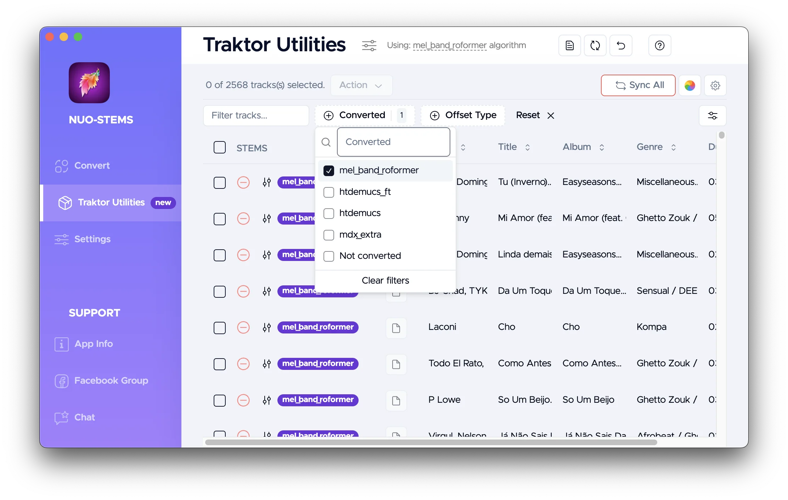
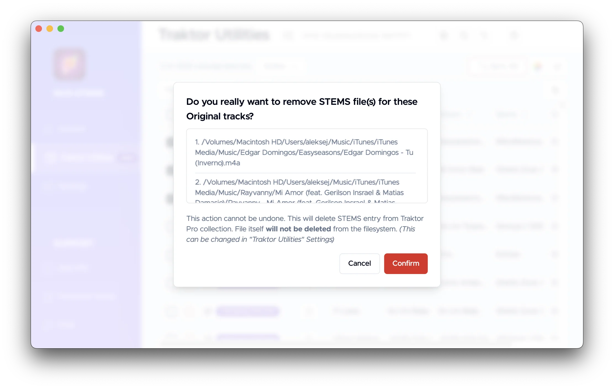
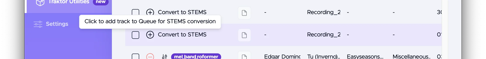
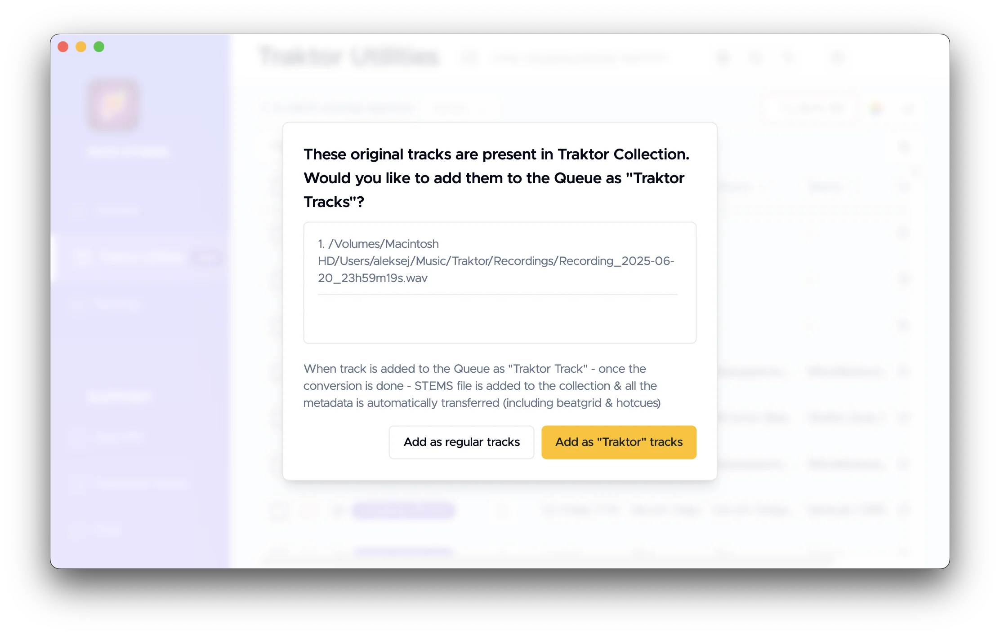
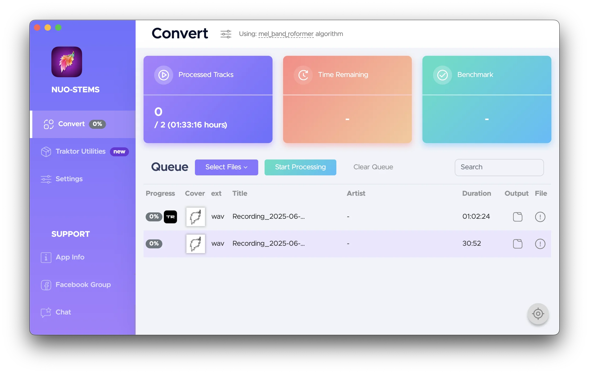
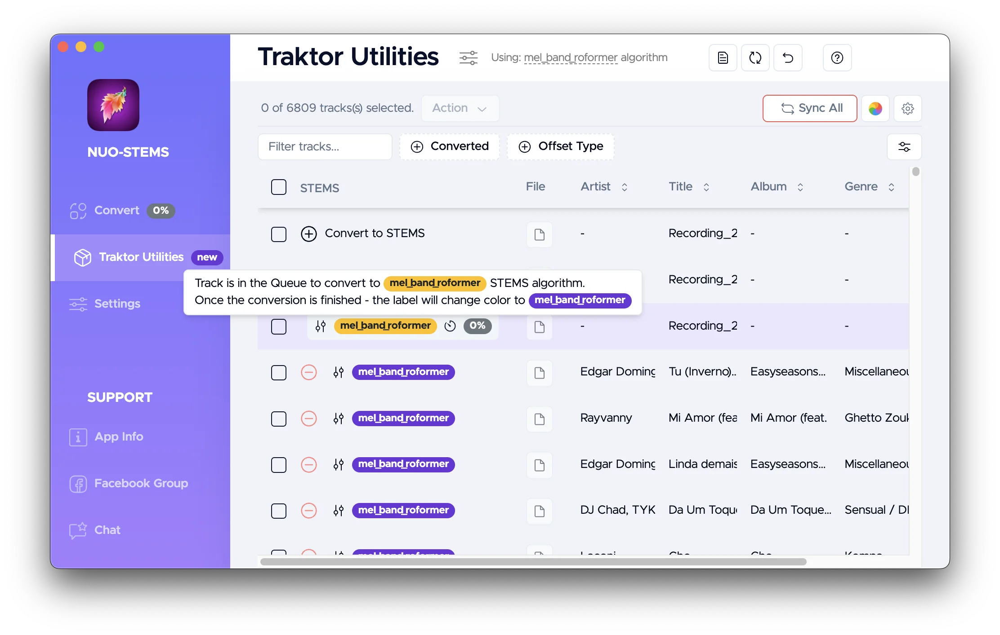
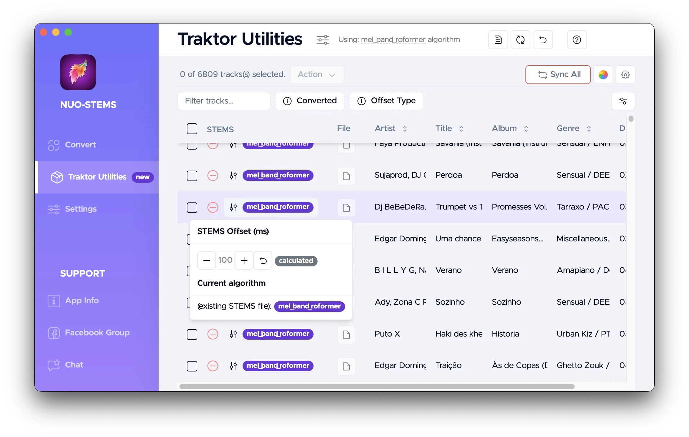
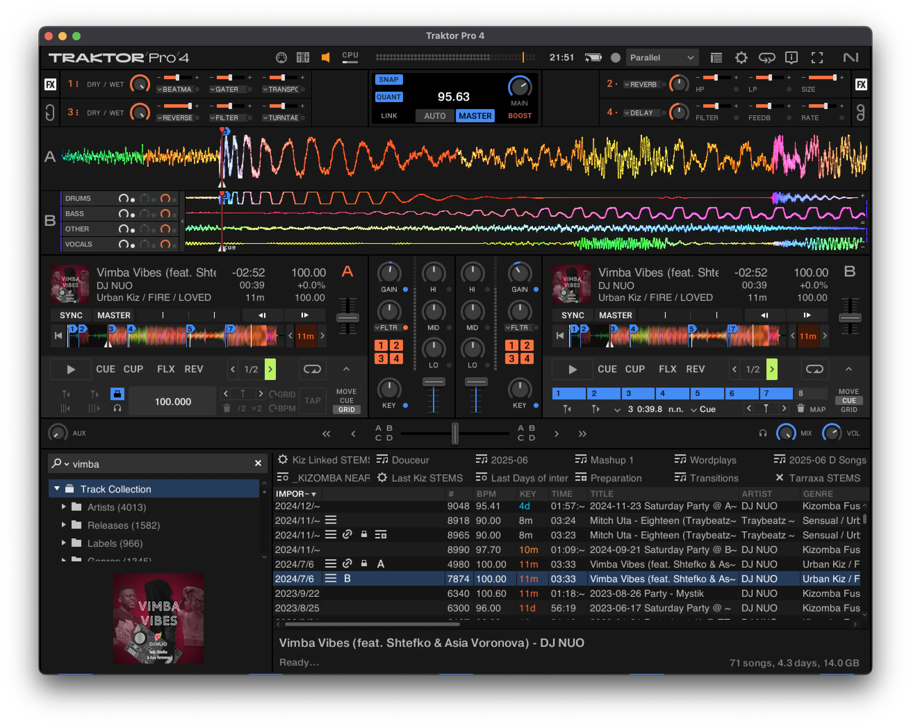

# Traktor Utilities - Table actions

Table view of Traktor Utilities allows you to see all the tracks in your Traktor Collection. Both the ones that have STEMS & the ones that don't.

## Filters

Filters at the top allow you to filter the tracks by:
- **Text search**. By all the columns.
- **Converted**. Whether they have STEMS and which algorithm they have.
- **Offset Type**. Whether the offset is manual or automatic. More on this in the next sections.

## Actions
### Multi-select

You can multi-select tracks by toggling the checkbox in the first column.

Then, **"Action"** button with dropdown will appear at the top with actions that can be performed on the selected tracks:
- Convert to STEMS. Adds them to the Queue to be converted to STEMS.
- Remove STEMS. Removes the STEMS files from the collection.
    - Also, can put STEMS into the Archite folder or into the Trash, depending on the [Settings](../settings#lonely-stems--deleting-collection-tracks).

### Remove STEMS action
If you click "Remove STEMS" button or "minus" icon on individual track...

...you will see a modal window to confirm the action

### Convert to STEMS action
If you click "Convert to STEMS" button or "plus" icon on individual track...

...you will see a modal window to confirm the action

You have 2 options:
- **Add as regular tracks**. Adds them to the Queue to be converted to STEMS. Just as if you dragged and dropped them to the Queue.
- **Add as "Traktor" tracks**. When track is added to the Queue as "Traktor Track" - once the conversion is done - STEMS file is added to the collection & all the metadata is automatically transferred (including beatgrid & hotcues)

*You can see 2 types of tracks in the Queue - "Traktor" tracks (have Traktor logo next to them) & regular tracks (don't have logo next to them)*

Track is then showed in Traktor Utilities as pending conversion:

### Change offset
:::warning
This feature is for advanced users only.
:::

As mentioned in [Advanced Settings - Added silence duration](../../settings/advanced-settings/#added-silence-duration) section, offset is calculated automatically to align beatgrids & hotcues in Traktor Pro between original & STEMS versions of the track.

Sometimes this calculated offset is not correct. 

In these cases, you can manually adjust the offset in milliseconds, so that the beatgrids & hotcues in Traktor Pro are transferred correctly.

*See Hotcue #3 - it's properly aligned between original & STEMS versions*