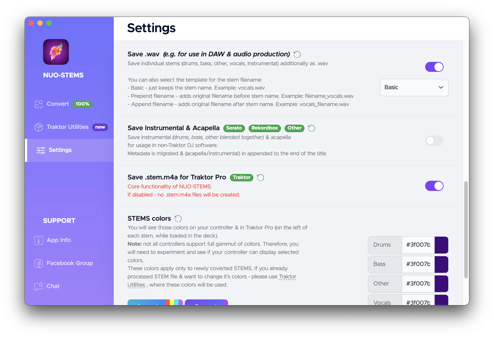
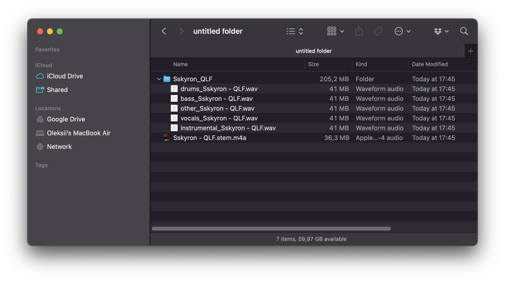

# Using with DAW (.wav stems)
## Settings
If you want to use .wav stems in your DAW (e.g. Ableton, Logic, Pro Tools, etc.), you will need to enable "save .wav" in the Settings.

Once enabled, any new files will be exported as .wav stems.

:::warning
If you previously exported stems as .stem.m4a, you will need to **re-export them as .wav** stems.
:::

## Example output
NUO-STEMS v3 exports these types of stems:

- Drums
- Bass
- Other
- Vocals
- Instrumental (full track without vocals)

There are 3 file conventions available:

- Basic. Example output:
    - [output folder]/[filename]/**drums.wav**
    - [output folder]/[filename]/**bass.wav**
    - [output folder]/[filename]/**other.wav**
    - [output folder]/[filename]/**vocals.wav**
    - [output folder]/[filename]/**instrumental.wav**
- Prepend filename. Example output:
    - [output folder]/[filename]/**filename_drums.wav**
    - [output folder]/[filename]/**filename_bass.wav**
    - [output folder]/[filename]/**filename_other.wav**
    - [output folder]/[filename]/**filename_vocals.wav**
    - [output folder]/[filename]/**filename_instrumental.wav**
- Append filename. Example output:
    - [output folder]/[filename]/**drums_filename.wav**
    - [output folder]/[filename]/**bass_filename.wav**
    - [output folder]/[filename]/**other_filename.wav**
    - [output folder]/[filename]/**vocals_filename.wav**
    - [output folder]/[filename]/**instrumental_filename.wav**

*Example output when using "Save .wav" setting*

## Using .wav stems in DAW
### Ableton
To use .wav stems in Ableton, you can drag and drop the stems into the project.
<video autoPlay loop muted playsInline style={{ maxWidth: "800px", width: "100%", height: "auto" }}>
  <source src="/videos/ableton-stems-import.webm" type="video/webm" />
  Your browser does not support the video tag.
</video>
:::tip
Hold Cmd (Mac) or Ctrl (Windows) when dragging to put each .wav into separate track.
:::